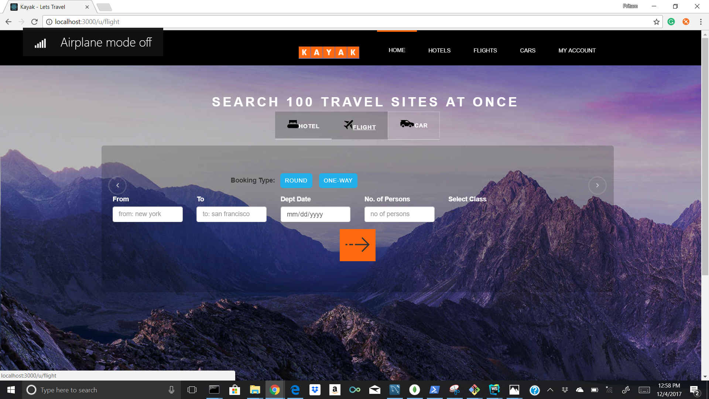
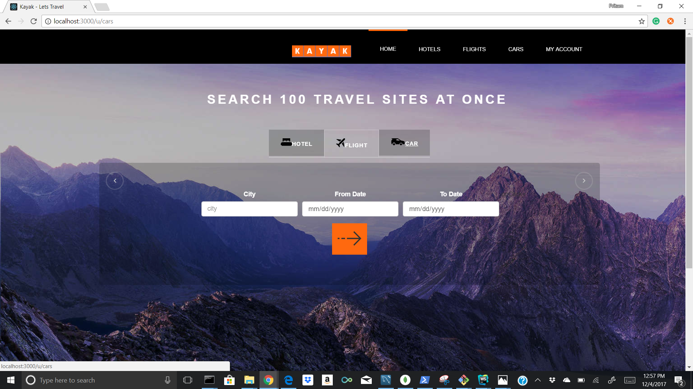
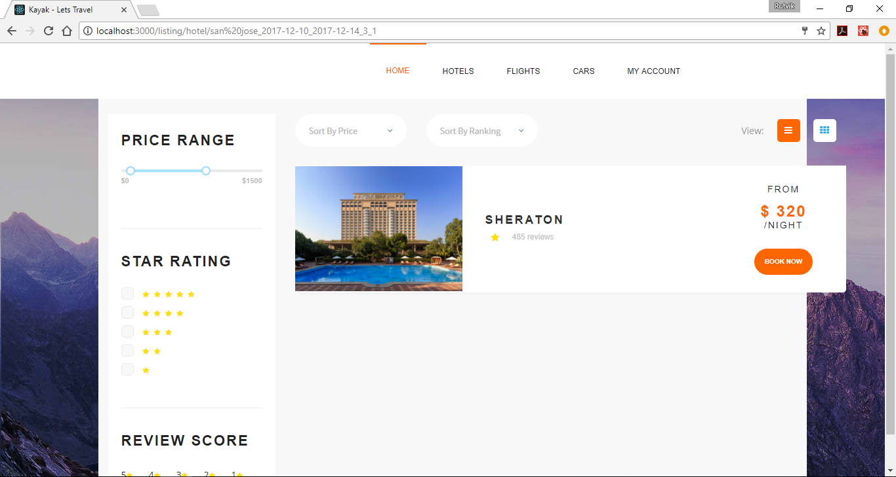
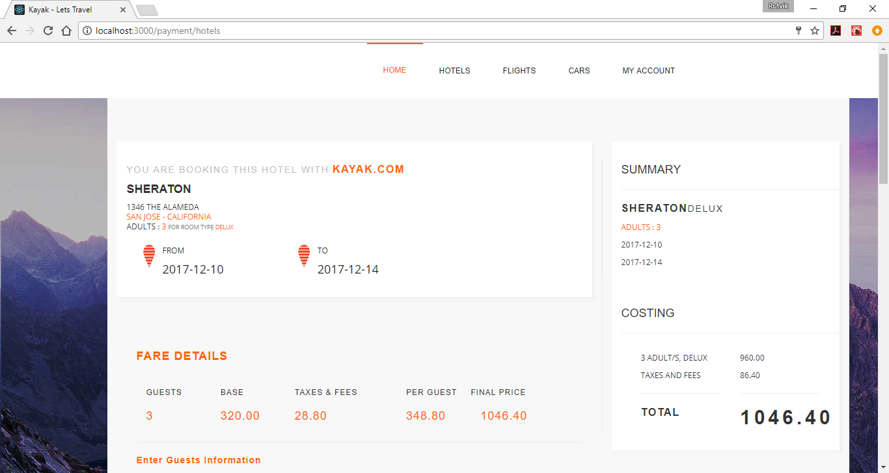
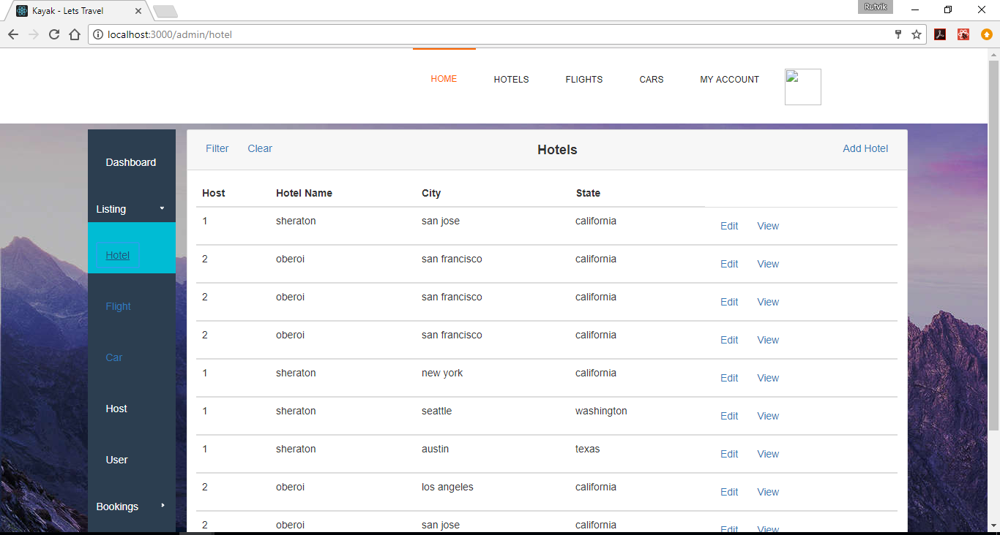

<link rel="stylesheet" href="readme-src/modest.css">

# Online Travel Reservation

> Team project for Graduate software engineering course Enterprise Distributed Systems.

## Goal

* The goal is to build a distributed enterprise web application which enables the user not only to search for Cars, Hotels and Flights and make a booking but also login/signup along with editing user preferences and viewing travel history. As well as create a Admin side which can be used to add/edit/delete Flights, Cars and Hotels and also be able to delete the user and view the analytics/statistics.

* We were tasked with this project requirement so that we can learn and develop enterprise MERN stack applications with the use of distributed publish-subscribe messaging system like Apache Kafka along with a variety of other technologies like Elasticsearch, redis, mocha, etc.

## System Design

### Technology stack

 
<table>
<thead>
<tr>
<th>Area</th>
<th>Technology</th>
</tr>
</thead>
<tbody>
	<tr>
		<td>Front-End</td>
		<td>React, Redux, React Router, Bootstrap, HTML5, CSS3, Javascript ( ES6 )</td>
	</tr>
	<tr>
		<td>Analytics Graphs</td>
		<td>D3.js</td>
	</tr>
	<tr>
		<td>Message-oriented middleware</td>
		<td>Apache Kafka</td>
	</tr>
	<tr>
		<td>Authentication Middleware</td>
		<td>Passport.js</td>
	</tr>
	<tr>
		<td>Back-End</td>
		<td>Express, Node.js</td>
	</tr>
	<tr>
		<td>In-Memory Caching / Datastore</td>
		<td>Redis</td>
	</tr>
	<tr>
		<td>Search and Analytics Engine</td>
		<td>Elasticsearch</td>
	</tr>
	<tr>
		<td>API Testing</td>
		<td>Mocha, Postman</td>
	</tr>
	<tr>
		<td>Performance Testing</td>
		<td>JMeter</td>
	</tr>
	<tr>
		<td>Database</td>
		<td>MySQL (Google Cloud Platform), MongoDB (Mongo Atlas on AWS)</td>
	</tr>
    <tr>
		<td>Deployment</td>
		<td>Google Compute Engine</td>
	</tr>
</tbody>
</table>
 

### Database
> Tables with large amount of data and which doesn't need transaction support in mongodb, flight car hotel
Tables with critical data and information that needs transaction support in mysql, like booking details, payment details and user info

> Database design and the data was critical for the project so To maintain consistency within team we deployed both our db on cloud. Also we used mongoose npm module, which is a wrapper for mongodb for creating structure of documents in a collection so that well defined data is inserted which helps in searching.

> We used database pl stored procedure for our booking and payment functionality so that we can provide transaction support and if anything goes wrong in between then we can roll back to a point where the database is in a consistent state.

## Screenshots

##### Home - Hotels

##### Home - Flights

##### Home - Cars

##### Hotel Listing

##### Car Listing

##### Flight Listing

##### Booking page

##### Analytics

##### Admin Flight - Add/Edit/Search

##### Admin Hotel - Add/Edit/Search

##### Admin Car - Add/Edit/Search

### Performance comparison

> This Performance comparison graph for four criterias 
> 1. Without kafka, connection pooling or redis
> 2. With kafka but no connection pooling and redis.
> 3. With kafka and connection pooling but no redis.
> 4. With kafka, connection pooling and redis.
 
> We believe that this graph is a very realistic representation of how the application would perform when deployed on a Enterprise level because as explained earlier we deployed our db on cloud , so this graph also includes the network latency.

> We tested the performance of api called list cars  which serves the functionality of getting all cars from our mongodb for the specific city and for each of these cars makes a search in mysql database to verify from booking table that the car is available on those dates.

> With kafka we can see the response time is very high.

> In our kafka implementation  strategy we tried to minimize the bottleneck for performance, so we had two topics for each api , one for request and other for response so there where multiple consumers listening to these topics simultaneously for request and response instead of single consumer with single topic serving all the requests serially eventually resulting into dropping of messages.

> Our approach to redis implementation was simple and effective. We used it at places which were database and read intensive like flight search car search. So when a user searches for a listing we create a search string with all criterias for search and use it for listing which is very similar to how kayak does it.we use this search string as key to store entries in redis. So when a user searches for  a listing with a search string we see if the search exist in redis, if it does then use it else send a message over kafka, get data from db, set it in the cache and show it to user. Here the user will get the data from cache on subsequent search. On our exploration for redis features we found that we can invalidate the cache after a fixed timeout, so we included that feature and set a time out of 3 sec. Also we invalidate cache entries when user adds a listing so that latest data is available for user. This boosted the application performance so much that i have even seen response times of 1ms. So in a hypothetical situation, when 1000 users search for a car in the same city for same from to date within a frame of 3 sec, they will get the response in 1ms.
Average response time falls to 980ms from 11000 ms.
Also we used hset instead of set which increases performance of redis by indexing.
